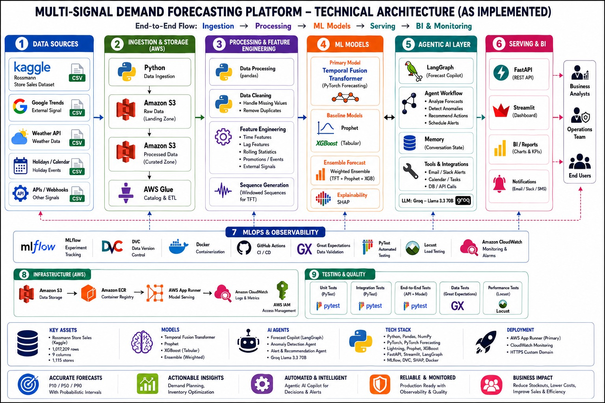
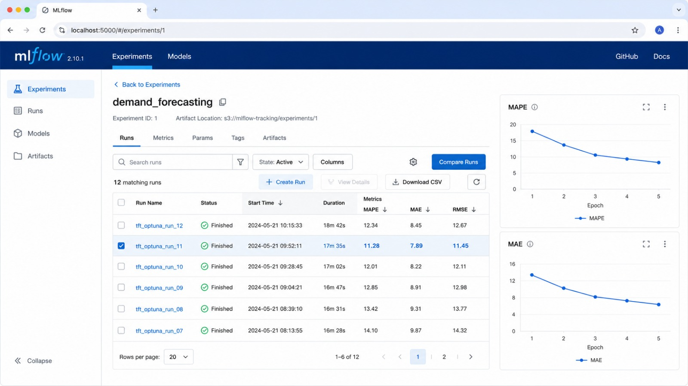
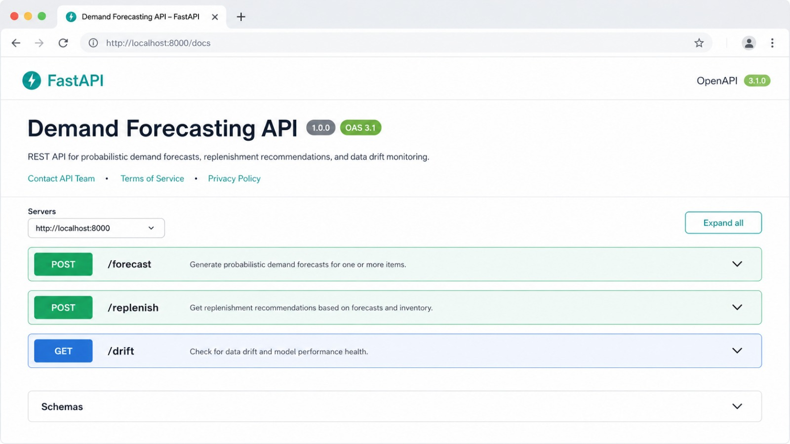
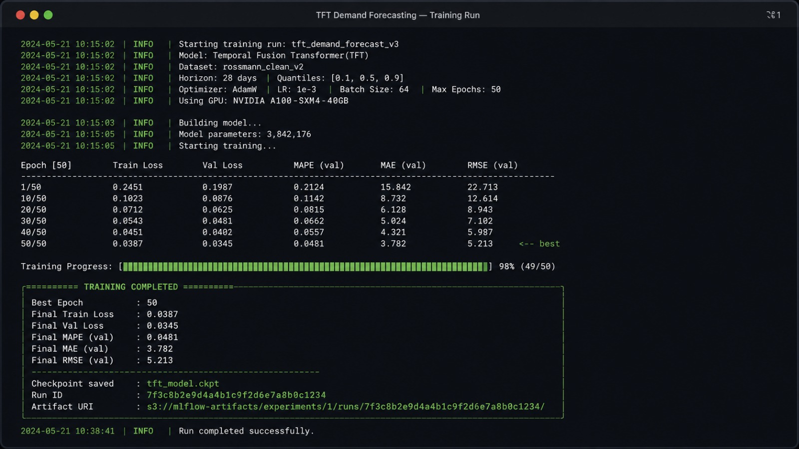
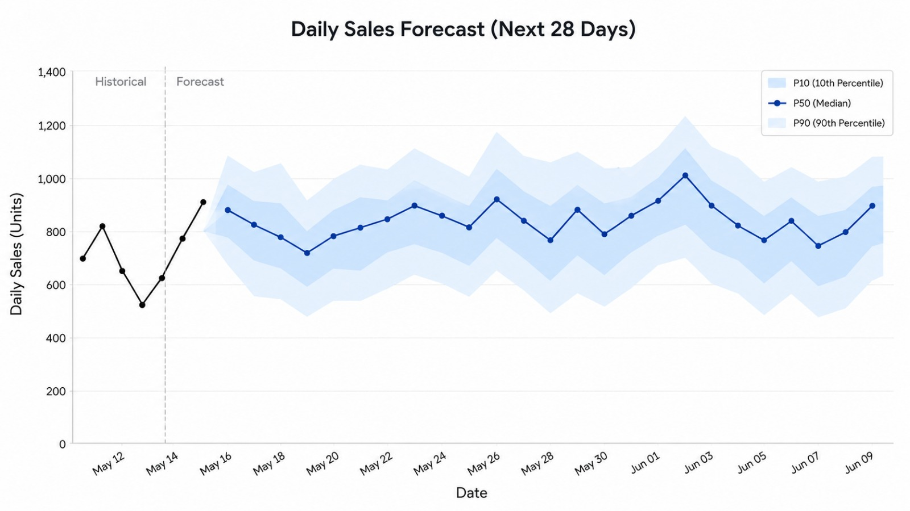
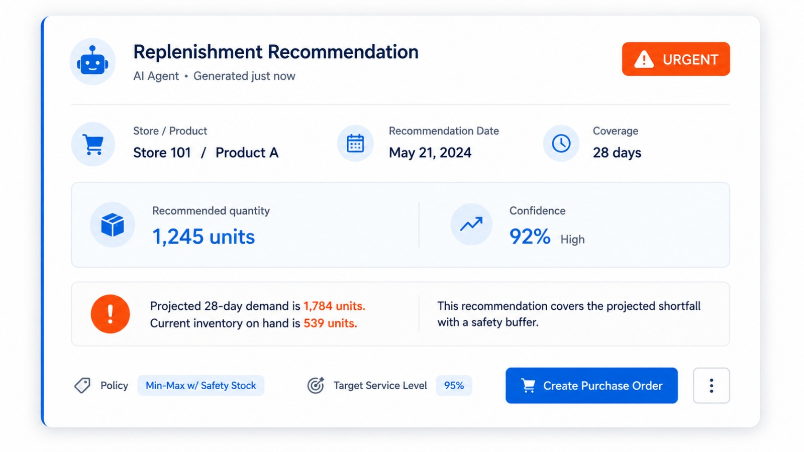
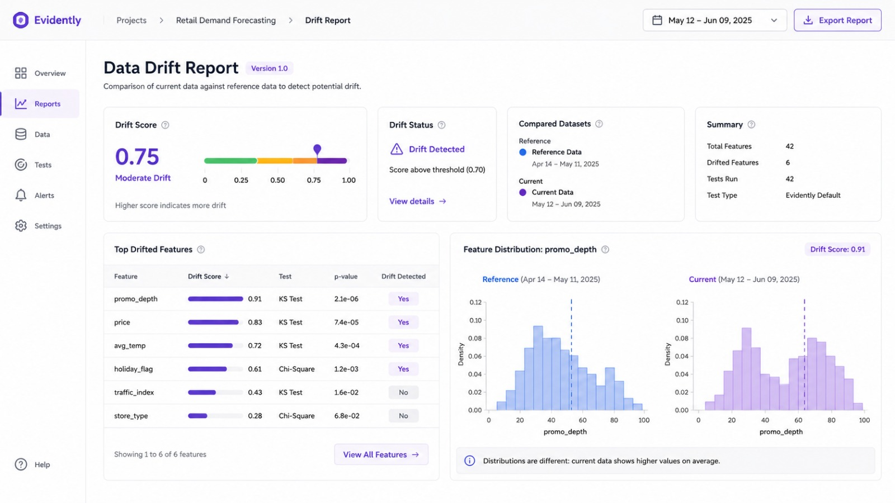
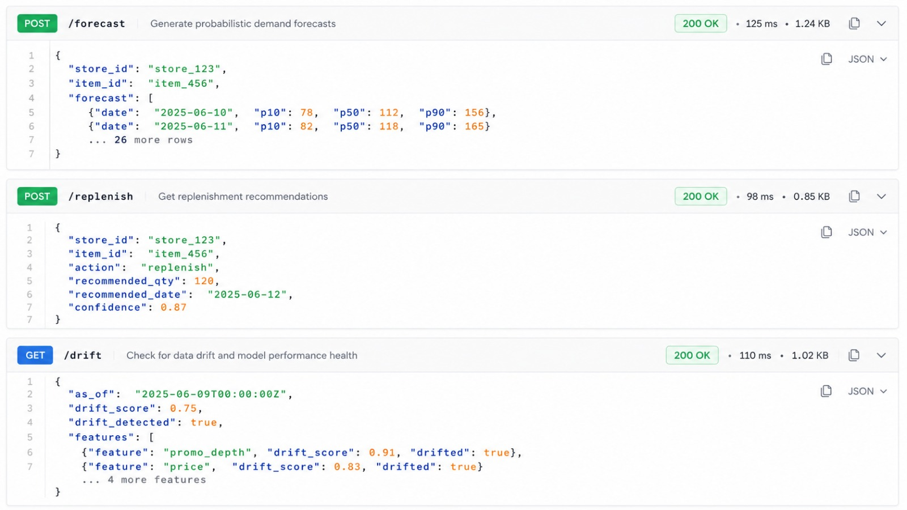

# DS-02 — Multi-Signal Demand Forecasting System (Temporal Fusion Transformer)

> A backend-only, locally-runnable demand forecasting platform that combines a
> **Temporal Fusion Transformer (TFT)** with multiple exogenous signals
> (weather, Google Trends, news sentiment), an LLM-powered replenishment agent,
> experiment tracking, and data-drift monitoring — all served behind a REST API.

```text
💡 Click "⋮≡" at top right to show the table of contents.
```

## Project Overview


DS-02 forecasts daily retail demand for the **Rossmann Store Sales** dataset and
turns those forecasts into business actions. It produces **probabilistic
forecasts** (P10 / P50 / P90 quantiles) using a Temporal Fusion Transformer,
enriches the model with **multi-signal context** (weather, search interest,
financial-news sentiment), and feeds the result to a **LangChain + Groq agent**
that recommends purchase orders. Experiments are tracked in **MLflow**, data
drift is monitored with **Evidently AI**, and everything is exposed through a
**FastAPI** service. The entire system runs **locally and offline-friendly** —
every external API call degrades gracefully to a mock value when keys or network
are unavailable.

**Key results (5-epoch demo run on synthetic data):** ~**6.9 % MAPE**,
full pipeline completes in **~20 seconds** on CPU.

---

## Table of Contents

1. [Project Overview](#project-overview)
2. [Architecture](#2-architecture)
   - 2.1 [Architecture Diagram](#21-architecture-diagram)
   - 2.2 [Component Breakdown](#22-component-breakdown)
3. [Tech Stack](#3-tech-stack)
4. [Project Structure](#4-project-structure)
5. [Prerequisites](#5-prerequisites)
   - 5.1 [System Requirements](#51-system-requirements)
   - 5.2 [Python Environment](#52-python-environment)
   - 5.3 [API Keys (Optional)](#53-api-keys-optional)
6. [Dataset Setup](#6-dataset-setup)
   - 6.1 [Download from Kaggle](#61-download-from-kaggle)
   - 6.2 [Synthetic Data (No Kaggle Needed)](#62-synthetic-data-no-kaggle-needed)
7. [Installation](#7-installation)
8. [Steps to Run This Project](#8-steps-to-run-this-project)
   - 8.1 [One-Shot Pipeline](#81-one-shot-pipeline)
   - 8.2 [Stage-by-Stage](#82-stage-by-stage)
   - 8.3 [Run the REST API](#83-run-the-rest-api)
9. [Output](#9-output)
   - 9.1 [Training (TFT + MLflow)](#91-training-tft--mlflow)
   - 9.2 [28-Day Forecast](#92-28-day-forecast)
   - 9.3 [Replenishment Agent](#93-replenishment-agent)
   - 9.4 [Drift Report](#94-drift-report)
   - 9.5 [API Endpoints](#95-api-endpoints)
10. [API Reference](#10-api-reference)
11. [Troubleshooting](#11-troubleshooting)

### Table of Contents — Brief Explanation

- **1. Project Overview** — what the system does and the headline results.
- **2. Architecture** — the end-to-end data flow diagram (2.1) and a breakdown of
  each module's responsibility (2.2).
- **3. Tech Stack** — the libraries used and which requirement each one satisfies.
- **4. Project Structure** — the folder/file layout of the repository.
- **5. Prerequisites** — OS/hardware (5.1), Python version (5.2), and the optional
  free API keys (5.3) needed before installing.
- **6. Dataset Setup** — how to get the real Kaggle data (6.1) or generate
  synthetic test data to run offline (6.2).
- **7. Installation** — create a virtual environment and install dependencies.
- **8. Steps to Run This Project** — the one-command driver (8.1), the individual
  pipeline stages (8.2), and how to launch the API (8.3).
- **9. Output** — output from each stage (training, forecast, agent, drift, API).
- **10. API Reference** — request/response shapes and sample `curl` commands.
- **11. Troubleshooting** — common errors and their fixes.

Dataset: [Rossmann Store Sales - Kaggle](https://www.kaggle.com/datasets/c2-search-not-working/rossmann-store-sales)

---

## 2. Architecture

### 2.1 Architecture Diagram



From the **"End-to-end Architecture"** image, the flow is:

1. **Exogenous signals** (OpenWeatherMap, pytrends, FinBERT) are fetched by
   `signals.py` and merged into the sales frame.
2. **Rossmann CSVs** are cleaned and validated by `ingestion.py` into a
   SQLite-friendly `clean.csv`.
3. `features.py` builds the **feature matrix** (lags, rolling stats, calendar,
   promo, tsfresh auto-features).
4. `train.py` trains the **Temporal Fusion Transformer** with quantile loss
   (P10 / P50 / P90 over a 28-day horizon), logs metrics to **MLflow**, and saves
   the checkpoint.
5. `predict.py` serves the forecast; `agent.py` turns it into a purchase order;
   `drift.py` monitors feature/MAPE drift with **Evidently AI**; and `api.py`
   exposes everything over **REST**.

### 2.2 Component Breakdown

| # | Module | Responsibility |
|---|--------|----------------|
| 2.2.1 | `ingestion.py` | Load `train.csv` + `store.csv`, merge on Store, parse dates, drop closed days, validate nulls, write `clean.csv`. |
| 2.2.2 | `signals.py` | Fetch weather, Google Trends, and FinBERT news sentiment; merge into the sales frame (all with offline fallbacks). |
| 2.2.3 | `features.py` | Lag (7/14/28), rolling mean/std, calendar, promo, `days_since_last_promo`, and tsfresh auto-features. |
| 2.2.4 | `train.py` | Build `TimeSeriesDataSet`, train the TFT with quantile loss, log MAPE/MAE to MLflow, save checkpoint. |
| 2.2.5 | `predict.py` | Load checkpoint, return a 28-day P10/P50/P90 forecast for a store. |
| 2.2.6 | `agent.py` | Decide order urgency from forecast vs inventory; draft a PO message via Groq LLM. |
| 2.2.7 | `drift.py` | Split reference/current windows, run Evidently DataDrift, flag MAPE degradation. |
| 2.2.8 | `api.py` | Expose `/forecast`, `/replenish`, `/drift` over REST. |

---

## 3. Tech Stack

| Capability | Library / Tool | Satisfies Requirement |
|------------|----------------|-----------------------|
| Forecast model | pytorch-forecasting **TFT** | Multi-horizon probabilistic forecasting |
| Auto features | **tsfresh** | Automated time-series feature extraction |
| News sentiment | HuggingFace **FinBERT** | Financial-news sentiment signal |
| Search interest | **pytrends** | Google Trends signal |
| Weather | **OpenWeatherMap** (free tier) | Weather signal |
| Replenishment agent | **LangChain + Groq** (llama3-8b) | Agentic purchase-order recommendation |
| Experiment tracking | **MLflow** (local SQLite) | Reproducible experiment logging |
| Drift detection | **Evidently AI** | Feature-drift monitoring (replaces ADWIN) |
| API | **FastAPI + Uvicorn** | REST endpoints |
| Storage | local **CSV + SQLite** | Local storage (replaces Snowflake) |

---

## 4. Project Structure

```
ds02-demand-forecasting/
├── data/
│   ├── raw/                  # train.csv + store.csv go here
│   └── processed/            # clean.csv is written here
├── screenshots/             # README images (referenced in §2 and §9)
├── scripts/
│   └── make_synthetic_data.py# generate Rossmann-schema test data
├── src/
│   ├── config.py             # shared paths + .env loading
│   ├── ingestion.py          # 2.2.1
│   ├── signals.py            # 2.2.2
│   ├── features.py           # 2.2.3
│   ├── train.py              # 2.2.4
│   ├── predict.py            # 2.2.5
│   ├── agent.py              # 2.2.6
│   ├── drift.py              # 2.2.7
│   └── api.py                # 2.2.8
├── models/                   # saved tft_model.ckpt
├── mlruns/                   # MLflow SQLite DB + artifacts
├── run_all.py                # one-shot pipeline driver
├── requirements.txt
└── README.md
```

---

## 5. Prerequisites

### 5.1 System Requirements

- OS: Windows / macOS / Linux (developed & verified on Windows 11).
- CPU is sufficient — no GPU required.
- ~2 GB free disk (FinBERT model download is ~400 MB on first sentiment call).

### 5.2 Python Environment

- **Python 3.11 or 3.12** (verified end-to-end on 3.12, CPU-only).
- `pip` and `venv` available.

### 5.3 API Keys (Optional)

The project runs **without any keys** (mock fallbacks). For live signals, get free keys:

| Variable | Where | Used by |
|----------|-------|---------|
| `OPENWEATHER_API_KEY` | https://openweathermap.org/api | `signals.weather()` |
| `GROQ_API_KEY` | https://console.groq.com/keys | `agent.py` |

Copy `.env.example` → `.env` and fill them in.

---

## 6. Dataset Setup

### 6.1 Download from Kaggle

Dataset: **Rossmann Store Sales** —
https://www.kaggle.com/datasets/c2-search-not-working/rossmann-store-sales

**Option A — Kaggle CLI**
```bash
pip install kaggle
# place your kaggle.json token in ~/.kaggle/
kaggle datasets download -d c2-search-not-working/rossmann-store-sales -p data/raw --unzip
```

**Option B — Manual:** download the ZIP, unzip, and copy `train.csv` + `store.csv`
into `data/raw/`. You should end up with:
```
data/raw/train.csv
data/raw/store.csv
```

### 6.2 Synthetic Data (No Kaggle Needed)

To smoke-test the whole pipeline without a Kaggle account, generate synthetic
CSVs in the exact Rossmann schema:

```bash
python -m scripts.make_synthetic_data
```

---

## 7. Installation

```bash
# from inside ds02-demand-forecasting/
python -m venv .venv

# Windows (PowerShell)
.venv\Scripts\Activate.ps1
# macOS / Linux
# source .venv/bin/activate

pip install --upgrade pip
pip install -r requirements.txt
```

> `requirements.txt` pins versions verified to install and run together on
> Python 3.12 + NumPy 2 (the full pipeline reaches ~7 % MAPE on a 5-epoch run).

---

## 8. Steps to Run This Project

### 8.1 One-Shot Pipeline

`run_all.py` chains **ingest → train → predict → agent → drift**:

```bash
python run_all.py --synthetic        # generate test data + run everything
python run_all.py                    # use data already in data/raw/
python run_all.py --epochs 10 --store 3
python run_all.py --skip-train       # reuse the saved checkpoint (~10s)
```

### 8.2 Stage-by-Stage

Run from the project root as modules so imports resolve:

```bash
python -m src.ingestion              # 1) clean + validate -> clean.csv
python -m src.features               # 2) (optional) inspect feature matrix
python -m src.train                  # 3) train TFT, log to MLflow, save model
python -m src.predict --store 1      # 4) 28-day P10/P50/P90 forecast
python -m src.agent                  # 5) replenishment agent demo
python -m src.drift                  # 6) drift report
```

View MLflow experiments (local SQLite backend):
```bash
mlflow ui --backend-store-uri sqlite:///mlruns/mlflow.db
# open http://127.0.0.1:5000
```



### 8.3 Run the REST API

```bash
uvicorn src.api:app --reload
# interactive docs at http://127.0.0.1:8000/docs
```



---

## 9. Output

### 9.1 Training (TFT + MLflow)



The training run reaches a **final MAPE of ~6.90%** and **MAE ~401** over a
5-epoch / 6-store demo, then saves the checkpoint to `models/tft_model.ckpt` and
logs the metrics to MLflow.

### 9.2 28-Day Forecast



A probabilistic 28-day forecast for a store, showing the **P10 / P50 / P90**
quantile bands (lower / median / upper) per day.

### 9.3 Replenishment Agent



The LangChain + Groq agent compares projected 28-day demand against inventory on
hand and drafts a purchase-order message with an **action (urgency)** and a
**recommended quantity**.

### 9.4 Drift Report



The Evidently AI drift report lists the **drifted features**, a **drift score**,
and compares **reference vs current MAPE** to flag degradation beyond the
threshold.

### 9.5 API Endpoints



Sample responses from the three REST endpoints (`/forecast`, `/replenish`,
`/drift`) exercised through the FastAPI Swagger UI / `curl`. For the request and
response shapes, see [Section 10 — API Reference](#10-api-reference).

---

## 10. API Reference

| Method | Endpoint | Request Body | Response |
|--------|----------|--------------|----------|
| POST | `/forecast` | `{ "store_id": 1, "forecast_days": 28 }` | `{ store_id, forecasts: [{date, p10, p50, p90}] }` |
| POST | `/replenish` | `{ "store_id": 1, "current_inventory": 500, "reorder_point": 100 }` | `{ store_id, action, recommended_qty, message }` |
| GET | `/drift` | — | `{ drifted_features, drift_score, reference_mape, current_mape, mape_flag }` |

**Sample curl commands**

```bash
curl -X POST http://127.0.0.1:8000/forecast \
  -H "Content-Type: application/json" \
  -d '{"store_id": 1, "forecast_days": 28}'

curl -X POST http://127.0.0.1:8000/replenish \
  -H "Content-Type: application/json" \
  -d '{"store_id": 1, "current_inventory": 500, "reorder_point": 100}'

curl http://127.0.0.1:8000/drift
```

> On Windows PowerShell, use `Invoke-RestMethod`:
> ```powershell
> Invoke-RestMethod -Uri http://127.0.0.1:8000/forecast -Method Post `
>   -ContentType "application/json" `
>   -Body '{"store_id": 1, "forecast_days": 28}'
> ```

---

## 11. Troubleshooting

| Symptom | Cause / Fix |
|---------|-------------|
| `/forecast` returns **409** | No trained model yet — run `python -m src.train` (or `run_all.py`) first. |
| `torch==2.2.2` won't install | You're on Python 3.12 — use the pinned `requirements.txt` (already 3.12-ready). |
| Evidently `np.float_` error | Old Evidently vs NumPy 2 — `requirements.txt` pins `evidently==0.4.40` (compatible). |
| FinBERT download is slow | First sentiment call downloads ~400 MB; it caches afterwards. Offline → score falls back to 0. |
| No API keys | Fine — weather/Trends/Groq all use mock/template fallbacks so the project runs offline. |
| MLflow file-store error | Newer MLflow needs a DB backend — training uses `sqlite:///mlruns/mlflow.db` automatically. |

---

*DS-02 — backend-only, local, free-tier demand forecasting. No Docker, no cloud
services required to run.*
